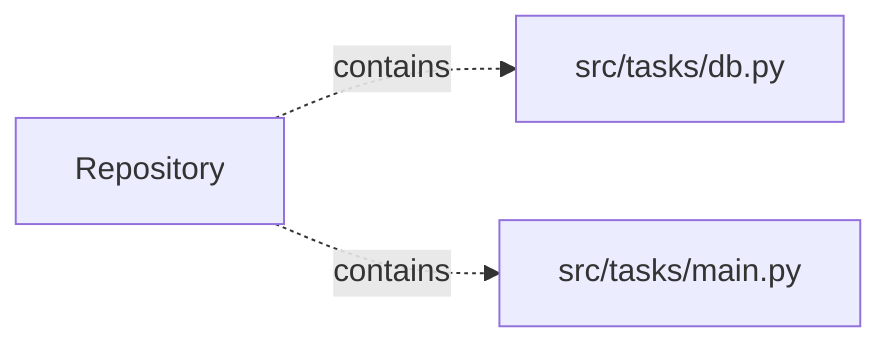

# task-management-api — project architecture

[README](README.md) · [Interview questions and answers](INTERVIEW_QA.md)

## Purpose and scope

Alice and Bob sign in and keep separate task lists. Every query is scoped to the signed-in owner.

This document describes files and symbols in this checkout. Deployment templates and statements in the original overview are distinguished from a verified running environment.

## Component diagram



For Python repositories, arrows show resolved local imports, not network calls or deployment order. Otherwise the diagram is a repository component map; containment arrows do not assert runtime integration.

## Components and responsibilities

| Component | Responsibility |
| --- | --- |
| [`src/tasks/main.py`](src/tasks/main.py) | HTTP handlers: `GET /healthz`, `POST /token`, `GET /tasks`, `POST /tasks`, `GET /tasks/{task_id}` |
| [`src/tasks/db.py`](src/tasks/db.py) | Functions: `connect`, `to_dict`, `list_tasks`, `get_task`, `add_task`, `update_task`, `delete_task` |
| [`requirements.txt`](requirements.txt) | Implementation or supporting configuration |
| [`tests/test_tasks.py`](tests/test_tasks.py) | Executable checks and regression examples |
| [`.github/workflows/ci.yml`](.github/workflows/ci.yml) | GitHub Actions job definitions |
| [`README.md`](README.md) | Project explanations or operating notes |

## Request interface

| Method and path | Handler | Source |
| --- | --- | --- |
| `GET /healthz` | `healthz` | [`src/tasks/main.py`](src/tasks/main.py#L78) |
| `POST /token` | `token` | [`src/tasks/main.py`](src/tasks/main.py#L83) |
| `GET /tasks` | `get_tasks` | [`src/tasks/main.py`](src/tasks/main.py#L91) |
| `POST /tasks` | `post_task` | [`src/tasks/main.py`](src/tasks/main.py#L103) |
| `GET /tasks/{task_id}` | `get_task` | [`src/tasks/main.py`](src/tasks/main.py#L109) |
| `PATCH /tasks/{task_id}` | `patch_task` | [`src/tasks/main.py`](src/tasks/main.py#L118) |
| `DELETE /tasks/{task_id}` | `remove_task` | [`src/tasks/main.py`](src/tasks/main.py#L130) |

The table lists literal route decorators found in the inspected Python modules. Router prefixes and middleware can add behavior; check the linked handler and application setup before calling an endpoint.

## Implementation walkthrough

### `current_user(credentials: HTTPAuthorizationCredentials | None=Depends(bearer))`

Source: [`src/tasks/main.py`](src/tasks/main.py#L56).

Calls visible in this function: `Depends`, `HTTPException`, `jwt.decode`, `payload.get`.

```python
def current_user(credentials: HTTPAuthorizationCredentials | None = Depends(bearer)):
    if credentials is None:
        raise HTTPException(status_code=401, detail="missing bearer token")
    try:
        payload = jwt.decode(credentials.credentials, SECRET, algorithms=["HS256"])
    except jwt.ExpiredSignatureError as exc:
        raise HTTPException(status_code=401, detail="token expired") from exc
    except jwt.PyJWTError as exc:
        raise HTTPException(status_code=401, detail="invalid token") from exc
    if payload.get("sub") not in USERS:
        raise HTTPException(status_code=401, detail="unknown user")
    return payload["sub"]
```

### `connect(path)`

Source: [`src/tasks/db.py`](src/tasks/db.py#L6).

Calls visible in this function: `connection.execute`, `sqlite3.connect`.

```python
def connect(path):
    connection = sqlite3.connect(path)
    connection.row_factory = sqlite3.Row
    connection.execute(
        "CREATE TABLE IF NOT EXISTS tasks ("
        "id INTEGER PRIMARY KEY, owner TEXT NOT NULL, title TEXT NOT NULL, "
        "done INTEGER NOT NULL DEFAULT 0, created_at TEXT NOT NULL DEFAULT CURRENT_TIMESTAMP)"
    )
    connection.execute("CREATE INDEX IF NOT EXISTS tasks_owner ON tasks (owner, id)")
    return connection
```

### `list_tasks(connection, owner, done=None, limit=50, offset=0)`

Source: [`src/tasks/db.py`](src/tasks/db.py#L24).

Calls visible in this function: `connection.execute`, `connection.execute(query + ' ORDER BY id LIMIT ? OFFSET ?', [*params, limit, offset]).fetchall`, `connection.execute(query.replace(COLUMNS, 'COUNT(*)'), params).fetchone`, `int`, `params.append`, `query.replace`, `to_dict`.

```python
def list_tasks(connection, owner, done=None, limit=50, offset=0):
    query = f"SELECT {COLUMNS} FROM tasks WHERE owner = ?"
    params = [owner]
    if done is not None:
        query += " AND done = ?"
        params.append(int(done))
    total = connection.execute(query.replace(COLUMNS, "COUNT(*)"), params).fetchone()[0]
    rows = connection.execute(query + " ORDER BY id LIMIT ? OFFSET ?", [*params, limit, offset]).fetchall()
    return [to_dict(row) for row in rows], total
```

### `update_task(connection, owner, task_id, title=None, done=None)`

Source: [`src/tasks/db.py`](src/tasks/db.py#L46).

Calls visible in this function: `connection.commit`, `connection.execute`, `get_task`, `int`.

```python
def update_task(connection, owner, task_id, title=None, done=None):
    if get_task(connection, owner, task_id) is None:
        return None
    if title is not None:
        connection.execute("UPDATE tasks SET title = ? WHERE id = ? AND owner = ?", (title, task_id, owner))
    if done is not None:
        connection.execute("UPDATE tasks SET done = ? WHERE id = ? AND owner = ?", (int(done), task_id, owner))
    connection.commit()
    return get_task(connection, owner, task_id)
```

## Validation and failure paths

| Explicit exception | Source |
| --- | --- |
| `HTTPException(status_code=401, detail='missing bearer token')` | [`src/tasks/main.py`](src/tasks/main.py#L58) |
| `HTTPException(status_code=401, detail='unknown user')` | [`src/tasks/main.py`](src/tasks/main.py#L66) |
| `HTTPException(status_code=422, detail='title is required')` | [`src/tasks/main.py`](src/tasks/main.py#L73) |
| `HTTPException(status_code=401, detail='wrong username or password')` | [`src/tasks/main.py`](src/tasks/main.py#L86) |
| `HTTPException(status_code=404, detail='task not found')` | [`src/tasks/main.py`](src/tasks/main.py#L113) |
| `HTTPException(status_code=422, detail='send title or done')` | [`src/tasks/main.py`](src/tasks/main.py#L120) |
| `HTTPException(status_code=404, detail='task not found')` | [`src/tasks/main.py`](src/tasks/main.py#L125) |
| `HTTPException(status_code=404, detail='task not found')` | [`src/tasks/main.py`](src/tasks/main.py#L134) |
| `HTTPException(status_code=401, detail='token expired')` | [`src/tasks/main.py`](src/tasks/main.py#L62) |
| `HTTPException(status_code=401, detail='invalid token')` | [`src/tasks/main.py`](src/tasks/main.py#L64) |

These are explicit exceptions in the inspected source, rather than a claim that every failure is handled. Follow the calling handler to see whether the exception becomes an HTTP response or propagates.

## Data and state

- [`src/tasks/main.py`](src/tasks/main.py) defines module-level containers: `USERS`.

Module-level dictionaries/lists live in a Python process. They can be fixtures or mutable state; inspect writes before treating them as persistent storage. A production extension would need to define persistence and concurrency behavior explicitly.

## Data flow and design decisions

### What is the input-to-output contract of `current_user`

In [`src/tasks/main.py`](src/tasks/main.py#L56), `current_user(credentials: HTTPAuthorizationCredentials | None=Depends(bearer))` receives the inputs. The function computes these intermediate values:

The implementation delegates or iterates directly; trace the calls in the source walkthrough.

Its result is defined by:

- `payload['sub']`

### Which decision rules or boundary conditions should an interviewer challenge

The implementation in [`src/tasks/main.py`](src/tasks/main.py#L56) branches on:

- `credentials is None`
- `payload.get('sub') not in USERS`

A useful extension is a table-driven test that covers each condition just below, at, and above its boundary where applicable. These expressions are the current rules; changing them changes behavior and should be justified by the project’s acceptance criteria.

## Setup and verification

The following commands are derived from the checked-in dependency/test contracts. Execute them from the repository root; the block prepares a local environment, not a cloud deployment.

```bash
python3 -m venv .venv
source .venv/bin/activate
python -m pip install -r requirements.txt
python -m pytest -q
```

Python dependencies: [`requirements.txt`](requirements.txt).

Test entry points: [`tests/test_tasks.py`](tests/test_tasks.py).

Automation definitions: [`.github/workflows/ci.yml`](.github/workflows/ci.yml). Read their triggers and job steps to determine what CI actually runs.

## Operating boundaries and design review

Before turning this checkout into a customer deployment, establish the input contract, data ownership, access controls, failure response, evaluation criteria, and rollback owner. Repository fixtures and unit tests demonstrate local behavior; they do not establish throughput, uptime, compliance, or business impact.

A useful architecture review starts with the linked implementation: identify where input enters, where a decision is made, which state can change, and which external dependency can fail. Add a deployment view only for infrastructure that is actually configured and exercised.
